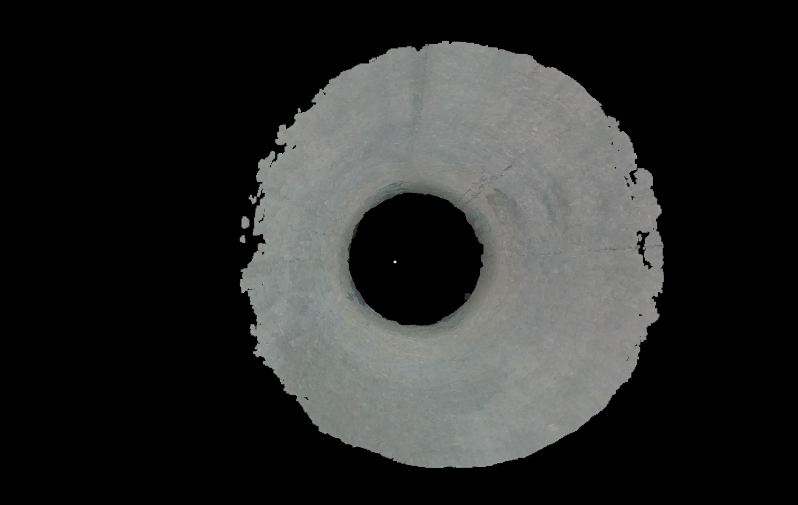
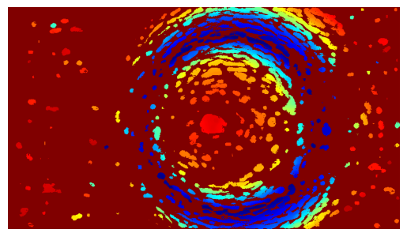
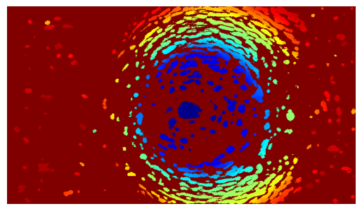

# demo_pipe: RGB-D Visual Odometry & Mapping in Confined Pipe Environments

This project explores the feasibility of using **RGB-D cameras** for **visual odometry** and **3D reconstruction** inside **confined pipe environments** representative of the **EU-DEMO fusion reactor**.  
It demonstrates systematic depth correction, feature-based pose estimation, and 3D mapping in challenging in-bore scenarios.  

**Read more:** [Thesis (PDF)](Yusuf_Acikel_thesis_IFL_final.pdf) | [Publication (PDF)](Azman_Azka___IEEE_SOFE_2025.pdf)


<p align="center">
  
  <br>
  <em></em>
</p>

---

## Key Contributions

- **Systematic Depth Error Analysis & Correction:**  
  Identified and analyzed systematic depth measurement errors in the Intel RealSense D405 when used inside small-diameter stainless-steel pipes. Developed a heuristic-based depth correction method to improve geometric fidelity and point cloud consistency.
<p align="center">
  
  
  <br>
  <em>Left: Raw Depth | Right: Corrected Depth</em>
</p>


- **Feature-Based RGB-D Visual Odometry:**  
  Implemented a robust feature detection and matching pipeline using ORB features to estimate camera poses within confined pipe environments. Demonstrated improved short-term alignment and reconstruction accuracy despite feature-sparse surfaces.

- **Dense 3D Mapping in Confined Environments:**  
  Generated dense, geometrically consistent 3D reconstructions of straight pipe sections under variable lighting conditions. Evaluated reconstruction quality quantitatively and qualitatively, highlighting both potential and limitations of RGB-D cameras in in-bore inspection.

- **Custom Test Bench & Robotic Deployment:**  
  Collaborated on the design, construction, and operation of a laboratory test bench replicating DEMO pipe environments, featuring a six-legged crawler platform for controlled in-line RGB-D camera deployment and data acquisition.

- **TRL-4:**  
  Achieved **Technology Readiness Level 4 (TRL-4)** under controlled laboratory conditions, providing a validated baseline for further research.

- **Insights for Nuclear Fusion Inspection Applications:**  
  Provided practical insights for RGB-D sensor deployment in in-bore nuclear environments, including considerations for lighting, pipe geometry, and systematic error mitigation.


## ⚙️ Project Setup

> Requires **Python 3.9–3.12**

```bash
git clone https://github.com/yusufacikel/demo_pipe.git
cd demo_pipe

# Project Setup
Requires Python version 3.9, 3.10, 3.11, or 3.12.

Clone the repository:
```bash
git clone https://github.com/yusufacikel/demo_pipe.git
```
Change directory:
```bash
cd demo_pipe
```
## For Linux users:
Make the setup script executable and run it:
```bash
chmod +x setup.sh
./setup.sh
```
## For Windows users:
Run the batch setup script:
```bash
.\setup.bat
```
